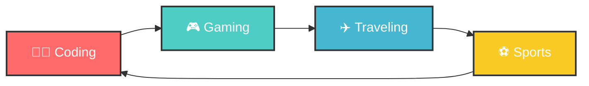

<div align="center">

<!-- Animated Header -->


<!-- Fixed Typing Animation - One line at a time -->


<!-- Profile Views & Badges -->
<p>
  
  
  
</p>

<!-- Portfolio Button -->
<a href="https://abhra.me" target="_blank">
  
</a>

</div>

---

<!-- About Section with Cool Design -->


### 🚀 About Me

```yaml
name: "Abhrajyoti"
role: "Student & Aspiring Developer"
motto: "Knowledge <<< Experience"
location: "India 🇮🇳"
learning_mode: true
coffee_addiction: extreme ☕
```

- 🎓 **Student** passionate about transforming ideas into reality
- 💡 I believe in **learning by doing** rather than just theoretical knowledge
- 🌱 Currently exploring **Advanced JavaScript**, **Cloud Technologies**, and **AI/ML**
- 🎯 Goal: Build impactful projects that solve real-world problems
- ⚡ Fun fact: I debug with `console.log()` and I'm not ashamed! 😄

---

<!-- Skills Section with Animated Icons -->
<h2 align="center">🛠️ Tech Arsenal</h2>

<div align="center">

### 🎨 Frontend Magic
<p>
  
</p>

### ⚙️ Backend Power
<p>
  
</p>

### 🔧 Tools & Platforms
<p>
  
</p>

</div>

---

<!-- Featured Project with Enhanced Design -->
<h2 align="center">✨ Featured Project Spotlight</h2>

<div align="center">
  <a href="https://github.com/abhrajyoti-01/typing-master">
    
  </a>
  
  **🎯 Typing Master** - Master your keyboard skills with this interactive typing practice tool!
  
  `JavaScript` `HTML5` `CSS3` `Interactive UI` `Real-time Stats`
</div>

---

<!-- GitHub Stats with Multiple Themes -->
<h2 align="center">📊 GitHub Analytics</h2>

<div align="center">
  
  
</div>

<div align="center">
  
</div>

<!-- Contribution Graph -->
<div align="center">
  
</div>

---

<!-- Life Beyond Code -->
<h2 align="center">🌍 Life Beyond Code</h2>

<div align="center">


```mermaid
graph LR
    A[👨‍💻 Coding] --> B[🎮 Gaming]
    B --> C[✈️ Traveling]
    C --> D[⚽ Sports]
    D --> A
    
    style A fill:#ff6b6b,stroke:#333,stroke-width:2px,color:#fff
    style B fill:#4ecdc4,stroke:#333,stroke-width:2px,color:#fff
    style C fill:#45b7d1,stroke:#333,stroke-width:2px,color:#fff
    style D fill:#f9ca24,stroke:#333,stroke-width:2px,color:#fff
```

</div>

<table align="center">
<tr>
<td align="center" width="200">
🎮<br/>
<b>Gaming</b><br/>
<sub>Conquering virtual worlds</sub>
</td>
<td align="center" width="200">
✈️<br/>
<b>Traveling</b><br/>
<sub>Exploring new horizons</sub>
</td>
<td align="center" width="200">
⚽<br/>
<b>Sports</b><br/>
<sub>Staying active & competitive</sub>
</td>
<td align="center" width="200">
💻<br/>
<b>Coding</b><br/>
<sub>Building cool stuff 24/7</sub>
</td>
</tr>
</table>

---

<!-- Connect Section -->
<h2 align="center">🤝 Let's Connect & Collaborate</h2>

<div align="center">

### 💬 Always excited to discuss:
`New Technologies` • `Project Ideas` • `Career Opportunities` • `Gaming` • `Travel Stories`

<p>
  <a href="https://abhra.me" target="_blank">
    
  </a>
  <br><br>
  <!-- Add more social links as needed -->
  
  
</p>

</div>

---

<!-- Fun Terminal Section -->
<h2 align="center">💻 Terminal Output</h2>

```bash
$ whoami
abhrajyoti-01

$ ls skills/
advanced_googling.exe    coffee_to_code_converter.py    infinite_curiosity.js
bug_hunter.java         stackoverflow_navigator.html   dream_to_reality.cpp

$ cat current_status.txt
🔥 Building awesome projects
📚 Learning new technologies
🎯 Seeking opportunities to grow
☕ Powered by coffee and determination

$ sudo make me_a_developer
[████████████████████] 78% Complete
Estimated time remaining: ∞ (Always learning!)
```

---

<!-- Footer -->


<div align="center">
  
</div>
