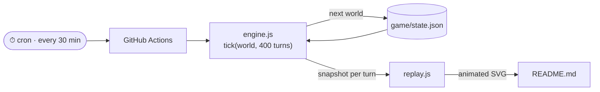

<div align="center">



<br />
<br />

**Student & Python developer**, curious about generative AI and learning by building.

[](https://abhra.me)
[](mailto:abhraayan@gmail.com)
[](https://github.com/abhrajyoti-01)


</div>

<br />

## `01` &nbsp;whoami

```python
class Abhrajyoti:
    role       = "student · Python developer"
    location   = "Karimpur, West Bengal, India"
    interested = ["generative AI", "LLMs", "AI-powered apps"]
    works_with = ["Python", "FastAPI", "Pydantic", "JavaScript"]
    approach   = "learning by building small, real projects"
    site       = "https://abhra.me"
```

<br />

## `02` &nbsp;/dev/dungeon

A **zero-player roguelike that lives inside this README.** Nobody controls it, not even me. Every 30 minutes a GitHub Action loads the world from [`game/state.json`](game/state.json), simulates 400 turns and records every one of them; the replay below auto-plays those real turns on loop until the next frame lands. The daemon `@` explores a procedurally generated filesystem, squashes bugs, picks up better debugging tools and goes deeper until something kills it. Then the next daemon is forked.

<!-- DUNGEON:START -->
<p align="center"></p>

<p align="center"><sub>↻ auto-playing the <b>400 turns</b> simulated in frame <b>#18</b> · rendered 2026-10-31 05:29 UTC by GitHub Actions · a new frame every ~30 minutes</sub></p>

<details>
<summary><b>Graveyard</b> · 3 daemons lost · 190 bugs squashed · deepest dive: depth 8 by daemon #3</summary>
<br />

| daemon | reached | lvl | kills | killed by | uptime |
| :-: | :-- | :-: | :-: | :-- | --: |
| `#003` | depth 8 · `/boot` | 9 | 57 | `segfault` | 1,376 turns |
| `#002` | depth 5 · `/proc` | 5 | 29 | `heisenbug` | 884 turns |
| `#001` | depth 7 · `/dev` | 8 | 44 | `segfault` | 978 turns |

</details>

<details>
<summary><b>Current frame as plain text</b></summary>
<br />

```diff
@@ /dev/dungeon · daemon #004 · depth 08 /boot · turn 004440 @@
 ┌─────────────────────────────────────────────────────┬──────────────────────┐
 │                                                     │ DAEMON #004   lvl 10 │
 │                            ┌──────────┐  ┌──────┐   │ pid 15555  deploying │
 │              ┌───────┐     │··········│  │··>···│   │                      │
 │              │·······│     │··········│  │······│   │ HP █████████ 102/102 │
 │              │·······│     └+───────+─┘  │······│   │ XP ███░░░░░░     29% │
 │   ┌──────┐   │·······│      ░       ░    └──+───┘   │                      │
 │   │······│   │·······│      ░       ░       ░       │ atk 23        def 10 │
 │   │······│   └──+────┘      ░       ░       ░       │ ) perf           +10 │
 │   │······│      ░           ░    ┌──+───────@┐      │ [ ci_pipeline     +4 │
 │   │······│      ░       ┌───+─┐  │···········│      │ ! hotfix          x1 │
 │   └─────+┘  ┌───+────┐  │·····│  │···········│      │ * stars          449 │
 │         ░   │········+░░+·····│  │···········│      │                      │
 │         ░░░░+········│  │·····│  │···········│      │ depth 08   kills 060 │
 │             │········│  │·····│  └───────────┘      │                      │
 │             │········│  └─────┘                     │ in view        clear │
 │             └────────┘                              │                      │
 │                                                     │                      │
 ├─────────────────────────────────────────────────────┴──────────────────────┤
 │ /boot 100% mapped · record depth 08 by #003 · 3 daemons lost               │
 └────────────────────────────────────────────────────────────────────────────┘
+ 004301  kill    squashed zombie_process · +31 xp · critical
+ 004304  loot    collected 48 stars
+ 004366  kill    squashed race_condition · +25 xp
+ 004368  kill    squashed race_condition · +25 xp · critical
+ 004370  kill    squashed race_condition · +25 xp
+ 004377  loot    collected 72 stars
+ 004378  loot    collected 24 stars
```

</details>
<!-- DUNGEON:END -->

<details>
<summary><b>Legend, rules & architecture</b></summary>
<br />

| glyph | what it is | glyph | what it is |
| :-: | :-- | :-: | :-- |
| `@` | **the daemon**, fully autonomous | `!` | **hotfix**, applied when HP runs low |
| `b` `x` `n` | bug · off_by_one (misses) · null_pointer | `)` | **debugging tool**, weapon: `grep` → `gdb` → `valgrind` → `ebpf` |
| `l` `r` | memory_leak (regenerates) · race_condition (acts twice) | `[` | **safety net**, armour: `linter` → `type_system` → `formal_proof` |
| `z` `H` | zombie_process (revives) · heisenbug (moves when observed) | `?` | **docs**, bonus XP |
| `S` `D` | segfault (crits) · **deadlock**, boss every 5th depth | `*` `>` | stars (score) · deploy to the next depth |

**The AI**, in priority order: patch when hurt → fight what's adjacent → chase what's awake → rest → hunt → loot → explore the nearest unmapped edge → deploy downstairs.
Every floor is a directory (`/home` → `/usr/src` → … → `/root` → `/dev/null`). Monsters scale per depth, and a deadlock waits on every fifth floor.


```mermaid
flowchart LR
    cron(["⏱ cron · every 30 min"]) --> job["GitHub Actions"]
    state[("game/state.json")] --> engine["engine.js<br/>tick(world, 400 turns)"]
    job --> engine
    engine -->|next world| state
    engine -->|snapshot per turn| replay["replay.js"]
    replay -->|animated SVG| readme["README.md"]
```

Deterministic by design: the seeded PRNG state is stored with the world, so a frame is a pure function of the previous one. READMEs can't run JavaScript, so motion comes from the replay: an SVG with discrete SMIL keyframes, generated from the recorded turns. Zero dependencies, vanilla JS.

</details>

<br />

## `03` &nbsp;Featured: AI HealthCare Assistant

<table>
<tr>
<td width="60%" valign="top">

### [AI-HealthCare-Application](https://github.com/abhrajyoti-01/AI-HealthCare-Application)

An **AI-powered healthcare chatbot** that gives educational medical guidance, detects emergency keywords, and shows practical **large language model (LLM) integration** with a fallback architecture, so it keeps answering when a model call fails.

`Python` `LLM` `generative AI` `chatbot`

</td>
<td width="40%" valign="top">

```text
 user message
      │
      ▼
 emergency keywords? ──▶ urgent guidance
      │ no
      ▼
 LLM ──(fails)──▶ fallback
      │
      ▼
 educational answer
```

</td>
</tr>
</table>

<br />

## `04` &nbsp;Projects

<table>
<tr>
<td width="50%" valign="top">

### [Pythia](https://github.com/abhrajyoti-01/Pythia)

`C99` `SQL` `B+ tree` `database`

Embeddable SQL database engine written from scratch in C99, built to learn how a database really works under the hood.

- single-file B+ tree storage with transactions
- query planner, interactive REPL and TCP server
- CSV import/export and a web console

</td>
<td width="50%" valign="top">

### [usbDacVolumeAndroid](https://github.com/abhrajyoti-01/usbDacVolumeAndroid)

`Java` `Android` `USB audio`

Android app that sets the hardware volume of USB DACs, fixing the low-volume problem with adapters like Apple's USB-C jack. My maintained fork of [polhdez/usbDacVolumeAndroid](https://github.com/polhdez/usbDacVolumeAndroid), now at v1.9.

- Samsung S24 Ultra and Android 15–16 support
- automatic mode: restores your volume on every connect and after reboot
- hardened against malformed USB descriptors

</td>
</tr>
<tr>
<td width="50%" valign="top">

### [arequest](https://github.com/abhrajyoti-01/arequest)

`Python` `asyncio` `HTTP`

Asynchronous HTTP client with a `requests`-compatible API: simple, fast and built for concurrency.

- familiar `requests`-style interface
- full `async` / `await` support
- connection pooling and automatic retries

</td>
<td width="50%" valign="top">

### [UnRAR](https://github.com/abhrajyoti-01/UnRAR)

`Rust` `egui` `desktop app`

Open-source, WinRAR-style archive manager with a native egui interface. MIT licensed.

- ZIP, RAR, 7z, TAR, GZ, BZ2, XZ and ZST: list, extract, test
- create ZIP archives with AES-256 encryption
- self-extracting (SFX) builder and a built-in viewer

</td>
</tr>
<tr>
<td width="50%" valign="top">

### [attendance-tracker](https://github.com/abhrajyoti-01/attendance-tracker)

`Python` `FastAPI` `computer vision`

Face-recognition attendance system with liveness anti-spoofing and per-organisation isolation.

- MTCNN face detection with ONNX FaceNet embeddings
- liveness checks: LBP texture, blink, head movement
- FastAPI, PostgreSQL, Redis and Celery behind a React dashboard

</td>
<td width="50%" valign="top">

### [rift](https://github.com/abhrajyoti-01/rift)

`Go` `networking` `observability`

Robust Infrastructure For Traffic management: a Go networking toolkit for running and inspecting network traffic.

- DNS monitoring and load balancing
- TLS inspection and media delivery
- built-in observability

</td>
</tr>
<tr>
<td width="50%" valign="top">

### [BWU-Portal-Lite](https://github.com/abhrajyoti-01/BWU-Portal-Lite)

`Python` `Telegram bot`

Telegram bot for Brainware University student self-service: attendance, fees, marks and notices, right inside the chat.

- everything in one chat
- no student data stored
- more features on the way

</td>
<td width="50%" valign="top">

### [dsa-in-c](https://github.com/abhrajyoti-01/dsa-in-c)

`C` `algorithms` `learning`

198 self-documented data structures and algorithms programs, from fundamentals to advanced.

- diagrams, pseudo code and dry runs for each program
- time and space complexity notes
- 31 LeetCode and HackerRank practice lessons

</td>
</tr>
</table>

<sub>More on my GitHub: <a href="https://github.com/abhrajyoti-01/solar-system">solar-system</a> (interactive 3D observatory in Three.js) · <a href="https://github.com/abhrajyoti-01/QuizGame">QuizGame</a> (1,009 questions, zero dependencies) · <a href="https://github.com/abhrajyoti-01/user-management-api">user-management-api</a> (FastAPI + Pydantic v2) · <a href="https://github.com/abhrajyoti-01/AuthFlow">AuthFlow</a></sub>

<br />

## `05` &nbsp;Activity

<sub>Regenerated every 30 minutes from the GitHub API by <a href=".github/scripts/update-readme.js"><code>update-readme.js</code></a>.</sub>

<!-- GH:STATS:START -->
<table align="center"><tr><td align="center" width="25%"><strong>31</strong><br /><sub>Repositories</sub></td><td align="center" width="25%"><strong>8</strong><br /><sub>Stars</sub></td><td align="center" width="25%"><strong>9</strong><br /><sub>Forks</sub></td><td align="center" width="25%"><strong>10</strong><br /><sub>Followers</sub></td></tr><tr><td align="center" width="25%"><strong>176</strong><br /><sub>Contributions (1y)</sub></td><td align="center" width="25%"><strong>132</strong><br /><sub>Commits (1y)</sub></td><td align="center" width="25%"><strong>2</strong><br /><sub>Pull requests</sub></td><td align="center" width="25%"><strong>0</strong><br /><sub>Issues opened</sub></td></tr></table>
<!-- GH:STATS:END -->

<!-- GH:LANGUAGES:START -->
> Byte-weighted across public, non-fork, non-archived repositories.

| Rank | Language | Share |
| :-: | :-- | :-: |
| **01** | `C` | **34.3%** |
| **02** | `TypeScript` | **21.3%** |
| **03** | `JavaScript` | **18.3%** |
| **04** | `Python` | **17.5%** |
| **05** | `Go` | **4.2%** |
| **06** | `Rust` | **2.1%** |
| **07** | `PHP` | **2.0%** |


<sub>Plus 3 additional languages.</sub>
<!-- GH:LANGUAGES:END -->

**Most starred**

<!-- GH:TOP_REPOS:START -->
<table><tr><td width="6%"><strong>01</strong></td><td><a href="https://github.com/abhrajyoti-01/arequest"><strong>arequest</strong></a><br /><sub>🚀 High-performance asynchronous HTTP client with a requests-compatible API — simpl…</sub></td><td align="right"><sub>★ 3 · forks 1 <code>Python</code></sub></td></tr><tr><td width="6%"><strong>02</strong></td><td><a href="https://github.com/abhrajyoti-01/AuthFlow"><strong>AuthFlow</strong></a><br /><sub>AuthFlow is a robust, full‑stack authentication system built with React (frontend)…</sub></td><td align="right"><sub>★ 1 · forks 3 <code>JavaScript</code></sub></td></tr><tr><td width="6%"><strong>03</strong></td><td><a href="https://github.com/abhrajyoti-01/LocalStore"><strong>LocalStore</strong></a><br /><sub>LocalStore is a modern e-commerce platform designed to connect customers with authe…</sub></td><td align="right"><sub>★ 1 · forks 2 <code>TypeScript</code></sub></td></tr><tr><td width="6%"><strong>04</strong></td><td><a href="https://github.com/abhrajyoti-01/employee-management-system"><strong>employee-management-system</strong></a><br /><sub>A modern full-stack web application for efficient employee record management</sub></td><td align="right"><sub>★ 1 · forks 2 <code>JavaScript</code></sub></td></tr><tr><td width="6%"><strong>05</strong></td><td><a href="https://github.com/abhrajyoti-01/typing-master"><strong>typing-master</strong></a><br /><sub>A platform where you can test your typing speed.</sub></td><td align="right"><sub>★ 1 · forks 0 <code>TypeScript</code></sub></td></tr><tr><td width="6%"><strong>06</strong></td><td><a href="https://github.com/abhrajyoti-01/rock_paper_game"><strong>rock_paper_game</strong></a><br /><sub>Simple Rock - Paper - Scissors Game using Node.js</sub></td><td align="right"><sub>★ 1 · forks 0 <code>JavaScript</code></sub></td></tr></table>
<!-- GH:TOP_REPOS:END -->

**Recently pushed**

<!-- GH:RECENT:START -->
<table><tr><td width="6%"><strong>01</strong></td><td><a href="https://github.com/abhrajyoti-01/dsa-in-c"><strong>dsa-in-c</strong></a><br /><sub>198 self-documented data structures and algorithms programs in C - fundamentals to…</sub></td><td align="right"><sub><code>C</code> · 3 days ago</sub></td></tr><tr><td width="6%"><strong>02</strong></td><td><a href="https://github.com/abhrajyoti-01/UnRAR"><strong>UnRAR</strong></a><br /><sub>UnRAR — open-source WinRAR-style archive manager in Rust (egui). ZIP/RAR/7z/TAR/GZ/…</sub></td><td align="right"><sub><code>Rust</code> · 3 days ago</sub></td></tr><tr><td width="6%"><strong>03</strong></td><td><a href="https://github.com/abhrajyoti-01/QuizGame"><strong>QuizGame</strong></a><br /><sub>Browser-based multiple-choice quiz game with 1,009 questions across 20 topics - Pyt…</sub></td><td align="right"><sub><code>Python</code> · 3 days ago</sub></td></tr><tr><td width="6%"><strong>04</strong></td><td><a href="https://github.com/abhrajyoti-01/BWU-Portal-Lite"><strong>BWU-Portal-Lite</strong></a><br /><sub>Brainware Portal Lite - Telegram bot for Brainware University Student Self-Service:…</sub></td><td align="right"><sub><code>Python</code> · 22 days ago</sub></td></tr><tr><td width="6%"><strong>05</strong></td><td><a href="https://github.com/abhrajyoti-01/Student-Management-System"><strong>Student-Management-System</strong></a><br /><sub>College DBMS project of Brainware University | Student Management System web app wi…</sub></td><td align="right"><sub><code>PHP</code> · 1 month ago</sub></td></tr></table>
<!-- GH:RECENT:END -->

<br />

## `06` &nbsp;Stack

<!-- GH:TECH:START -->
<div align="center">

**Languages & runtimes**


**Frameworks & delivery**


**Infrastructure**


</div>
<!-- GH:TECH:END -->

<br />

---

<div align="center">

**Into Python or generative AI? I'm always happy to learn, collaborate or just talk shop.**

[abhra.me](https://abhra.me) &nbsp;·&nbsp; [abhraayan@gmail.com](mailto:abhraayan@gmail.com) &nbsp;·&nbsp; [@abhrajyoti-01](https://github.com/abhrajyoti-01)

<sub>This README rebuilds itself every 30 minutes: live stats from the GitHub API plus a fresh frame of /dev/dungeon, with no manual edits.</sub>

</div>
