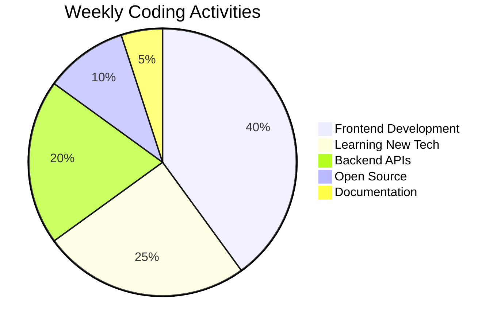

```mermaid
graph LR
    A[👨‍💻 Coding] --> B[🎮 Gaming]
    B --> C[✈️ Traveling]
    C --> D[⚽ Sports]
    D --> A

    style A fill:#ff6b6b,stroke:#333,stroke-width:2px,color:#fff
    style B fill:#4ecdc4,stroke:#333,stroke-width:2px,color:#fff
    style C fill:#45b7d1,stroke:#333,stroke-width:2px,color:#fff
    style D fill:#f9ca24,stroke:#333,stroke-width:2px,color:#fff
```

<div align="center">

<!-- Animated Header -->


<!-- Dynamic Typing Animation -->


<!-- Real-time Status Badges -->
<p>
  
  
  
  
</p>

<!-- Portfolio Button -->
<a href="https://abhra.me" target="_blank">
  
</a>

</div>

---

<!-- GitHub Trophy Display -->
<h2 align="center">🏆 GitHub Trophies</h2>

<div align="center">
  
</div>

---

<!-- Visitor's World Map -->
<h2 align="center">🌍 Visitors Around the Globe</h2>

<div align="center">
  <!-- Country flags of recent visitors -->
  <p>
    
    
    
    
    
  </p>
</div>

---

<!-- About Section -->


### 🚀 About Me

```yaml
name: "Abhrajyoti"
role: "Student & Aspiring Developer"
motto: "Knowledge <<< Experience"
location: "Karimpur, West Bengal, India 🇮🇳"
current_status: "Building cool projects 🚧"
learning_mode: true
coffee_addiction: extreme ☕
fun_fact: "I think in code and dream in algorithms"
```

- 🎓 **Student** passionate about transforming ideas into reality
- 💡 I believe in **learning by doing** rather than just theoretical knowledge
- 🌱 Currently exploring **Advanced JavaScript**, **Cloud Technologies**, and **AI/ML**
- 🎯 Goal: Build impactful projects that solve real-world problems
- ⚡ Fun fact: I debug with `console.log()` and I'm not ashamed! 😄

---

<!-- GitHub Metrics with Working Alternatives -->
<h2 align="center">📈 Live GitHub Activity Dashboard</h2>

<div align="center">

<!-- GitHub Profile Summary Cards -->


<br/>

<!-- Most Used Languages & Commit Stats -->


<br/>

<!-- GitHub Stats & Productive Time -->


</div>

---

<!-- Skill Quiz Section -->
<h2 align="center">🧠 Test Your Knowledge!</h2>

<div align="center">

**🤔 Quick Quiz: Guess My Favorite!**

<details>
<summary>🎮 What's my favorite game genre?</summary>
<br>
<b>Answer:</b> Marvel's Spider-Man: Miles Morales! 🎯
<br>
<i>I love games that make me think and plan ahead - just like coding!</i>
</details>

<details>
<summary>☕ How many cups of coffee do I drink per day?</summary>
<br>
<b>Answer:</b> 1-3 cups! ☕☕☕☕☕
<br>
<i>Coffee is my coding fuel! Can't function without it.</i>
</details>

<details>
<summary>🏏 Which IPL team do I support?</summary>
<br>
<b>Answer:</b> Jay Shah ❤️
<br>
<i>Script Writer 🏆</i>
</details>

</div>

---

<!-- Skills Section with Animated Icons -->
<h2 align="center">🛠️ Tech Arsenal & Skill Levels</h2>

<div align="center">

### 🎨 Frontend Magic

<p>
  
</p>

### ⚙️ Backend Power

<p>
  
</p>

### 🔧 Tools & Platforms

<p>
  
</p>

</div>

<!-- Skill Progress Bars -->
<div align="center">

| Technology |            Proficiency            | Usage  |
| :--------: | :-------------------------------: | :----: |
| JavaScript |  | Daily  |
|   Python   |  | Weekly |
|   React    |  | Daily  |
|  Node.js   |  | Weekly |
|    Java    |  | Yearly |

</div>

---

<!-- Weekly Development Breakdown -->
<h2 align="center">📅 This Week's Development Journey</h2>

<div align="center">



<table align="center">
<tr>
<td align="center"><b>🌅 Monday</b><br/>React Components<br/>🎯 3 hours</td>
<td align="center"><b>🔥 Tuesday</b><br/>Node.js APIs<br/>🎯 4 hours</td>
<td align="center"><b>⚡ Wednesday</b><br/>Learning Python<br/>🎯 2.5 hours</td>
<td align="center"><b>🚀 Thursday</b><br/>Open Source<br/>🎯 3.5 hours</td>
<td align="center"><b>🎉 Friday</b><br/>Project Planning<br/>🎯 2 hours</td>
<td align="center"><b>🎮 Weekend</b><br/>Side Projects<br/>🎯 5 hours</td>
</tr>
</table>

</div>

---

<!-- Contribution Heatmap -->
<h2 align="center">🔥 Contribution Heatmap</h2>

<div align="center">
  
  
  <p>
    
    
    
  </p>
</div>

---

<!-- Interactive Games -->
<h2 align="center">🎮 Interactive Mini Games</h2>

<div align="center">

**🪨📄✂️ Rock Paper Scissors - Choose your weapon!**

<a href="https://github.com/abhrajyoti-01/abhrajyoti-01/issues/new?title=🪨+Rock+Challenge&body=You+chose+Rock!+🪨%0A%0AI+choose...+📄+Paper!%0A%0A📄+Paper+covers+🪨+Rock!%0A%0A**I+WIN!**+😄%0A%0AThanks+for+playing!+Want+to+try+again?">
  
</a>
<a href="https://github.com/abhrajyoti-01/abhrajyoti-01/issues/new?title=📄+Paper+Challenge&body=You+chose+Paper!+📄%0A%0AI+choose...+✂️+Scissors!%0A%0A✂️+Scissors+cut+📄+Paper!%0A%0A**I+WIN!**+😄%0A%0AThanks+for+playing!+Want+to+try+again?">
  
</a>
<a href="https://github.com/abhrajyoti-01/abhrajyoti-01/issues/new?title=✂️+Scissors+Challenge&body=You+chose+Scissors!+✂️%0A%0AI+choose...+🪨+Rock!%0A%0A🪨+Rock+crushes+✂️+Scissors!%0A%0A**I+WIN!**+😄%0A%0AThanks+for+playing!+Want+to+try+again?">
  
</a>

**Current Score:** Abhrajyoti: ∞ | Visitors: 0 😉

</div>

---

<!-- Guess the Number Game -->
<h2 align="center">🔢 Guess My Lucky Number!</h2>

<div align="center">

**I'm thinking of a number between 1-10... Can you guess it?**

<a href="https://github.com/abhrajyoti-01/abhrajyoti-01/issues/new?title=🎯+Guess+1&body=You+guessed+1!%0A%0AMy+number+was+7!%0A%0A❌+Close+but+not+quite!+Try+again!">
  
</a>
<a href="https://github.com/abhrajyoti-01/abhrajyoti-01/issues/new?title=🎯+Guess+2&body=You+guessed+2!%0A%0AMy+number+was+7!%0A%0A❌+Not+quite!+Try+again!">
  
</a>
<a href="https://github.com/abhrajyoti-01/abhrajyoti-01/issues/new?title=🎯+Guess+3&body=You+guessed+3!%0A%0AMy+number+was+7!%0A%0A❌+Getting+warmer!+Try+again!">
  
</a>
<a href="https://github.com/abhrajyoti-01/abhrajyoti-01/issues/new?title=🎯+Guess+4&body=You+guessed+4!%0A%0AMy+number+was+7!%0A%0A❌+Close!+Try+again!">
  
</a>
<a href="https://github.com/abhrajyoti-01/abhrajyoti-01/issues/new?title=🎯+Guess+5&body=You+guessed+5!%0A%0AMy+number+was+7!%0A%0A❌+Very+close!+Try+again!">
  
</a>
<br/>
<a href="https://github.com/abhrajyoti-01/abhrajyoti-01/issues/new?title=🎯+Guess+6&body=You+guessed+6!%0A%0AMy+number+was+7!%0A%0A❌+So+close!+Try+again!">
  
</a>
<a href="https://github.com/abhrajyoti-01/abhrajyoti-01/issues/new?title=🎯+Guess+7&body=You+guessed+7!%0A%0AMy+number+was+7!%0A%0A🎉+**CORRECT!**+You're+amazing!+🎉%0A%0A🏆+You+win!+Thanks+for+playing!">
  
</a>
<a href="https://github.com/abhrajyoti-01/abhrajyoti-01/issues/new?title=🎯+Guess+8&body=You+guessed+8!%0A%0AMy+number+was+7!%0A%0A❌+So+close!+Try+again!">
  
</a>
<a href="https://github.com/abhrajyoti-01/abhrajyoti-01/issues/new?title=🎯+Guess+9&body=You+guessed+9!%0A%0AMy+number+was+7!%0A%0A❌+Close!+Try+again!">
  
</a>
<a href="https://github.com/abhrajyoti-01/abhrajyoti-01/issues/new?title=🎯+Guess+10&body=You+guessed+10!%0A%0AMy+number+was+7!%0A%0A❌+Not+quite!+Try+again!">
  
</a>

_Hint: It's my lucky number! 🍀_

</div>

---

<!-- Featured Project -->
<h2 align="center">✨ Featured Project Spotlight</h2>

<div align="center">
  <a href="https://github.com/abhrajyoti-01/typing-master">
    
  </a>
  
  **🎯 Typing Master** - Master your keyboard skills with this interactive typing practice tool!
  
  <a href="https://github.com/abhrajyoti-01/typing-master">
    
  </a>
  
  
  
  `JavaScript` `HTML5` `CSS3` `Interactive UI` `Real-time Stats`
</div>

---

<!-- Daily Code Inspiration -->
<h2 align="center">💭 Daily Code Inspiration</h2>

<div align="center">

```javascript
// Today's Motivation - Updated: 2025-12-23 18:51:30 UTC
const motivation = {
    date: "2025-12-23",
    time: "18:51:30 UTC",
    quote: "Good code is its own best documentation.",
    author: "Steve McConnell",
    mood: "🚀 Ready",
    energy: "☕☕☕☕⚡ Supercharged",
    goal: "Write code that changes lives!",
    status: "🔥 On fire!"
};

console.log(`"${motivation.quote} - ${motivation.author}"`);
// Output: "Good code is its own best documentation. - Steve McConnell"
```


</div>

---

<!-- GitHub Analytics -->
<h2 align="center">📊 GitHub Analytics</h2>
<!-- Activity Graph -->
<div align="center">
  
</div>

---

<!-- Support & Sponsor Section -->
<h2 align="center">☕ Support My Work</h2>

<div align="center">

**Enjoying my projects? Consider supporting me!**

<a href="https://www.buymeacoffee.com/abhrajyoti">
  
</a>
<a href="https://github.com/sponsors/abhrajyoti-01">
  
</a>

<p><i>Your support helps me create more awesome projects and keep learning! 🚀</i></p>

</div>

---

<!-- Mood Tracker -->
<h2 align="center">😄 Today's Coding Mood</h2>

<div align="center">

**How am I feeling about coding today?**

<a href="https://github.com/abhrajyoti-01/abhrajyoti-01/issues/new?title=😄+Fantastic+Mood&body=I'm+feeling+fantastic+about+coding+today!+%F0%9F%9A%80%0A%0ACurrent+mood:+😄+Ready+to+conquer+any+bug!">
  
</a>
<a href="https://github.com/abhrajyoti-01/abhrajyoti-01/issues/new?title=😊+Good+Mood&body=Having+a+good+coding+day!+%F0%9F%91%A8%E2%80%8D%F0%9F%92%BB%0A%0ACurrent+mood:+😊+Productive+and+happy!">
  
</a>
<a href="https://github.com/abhrajyoti-01/abhrajyoti-01/issues/new?title=😐+Okay+Mood&body=It's+an+okay+coding+day.+%F0%9F%A4%B7%E2%80%8D%E2%99%82%EF%B8%8F%0A%0ACurrent+mood:+😐+Getting+things+done.">
  
</a>

_Current Mood: 😄 Fantastic - Ready to code the world!_

</div>

---

<!-- Life Beyond Code with Mermaid Graph -->
<h2 align="center">🌍 Life Beyond Code</h2>

<div align="center">



</div>

<table align="center">
<tr>
<td align="center" width="200">
🎮<br/>
<b>Gaming</b><br/>
<sub>Conquering virtual worlds</sub><br/>

</td>
<td align="center" width="200">
✈️<br/>
<b>Traveling</b><br/>
<sub>Exploring new horizons</sub><br/>

</td>
<td align="center" width="200">
⚽<br/>
<b>Sports</b><br/>
<sub>Staying active & competitive</sub><br/>

</td>
<td align="center" width="200">
💻<br/>
<b>Coding</b><br/>
<sub>Building cool stuff 24/7</sub><br/>

</td>
</tr>
</table>

---

<!-- Achievement Showcase -->
<h2 align="center">🎖️ Recent Achievements</h2>

<div align="center">

<table>
<tr>
<td align="center">
🏆<br/>
<b>First Repository</b><br/>
<sub>Created my first GitHub repo!</sub><br/>

</td>
<td align="center">
⭐<br/>
<b>First Star</b><br/>
<sub>Got my first GitHub star!</sub><br/>

</td>
<td align="center">
🔀<br/>
<b>First Fork</b><br/>
<sub>Someone forked my project!</sub><br/>

</td>
<td align="center">
🎯<br/>
<b>100 Commits</b><br/>
<sub>Reached 100 commits milestone!</sub><br/>

</td>
</tr>
</table>

</div>

---

<!-- Random Joke -->
<h2 align="center">😂 Random Developer Joke</h2>

<div align="center">
  
  
  *Refresh the page for a new joke! 🔄*
</div>

---

<!-- Learning Progress Tracker -->
<h2 align="center">📚 Current Learning Journey</h2>

<div align="center">

**🎯 What I'm Learning Right Now:**

```yaml
current_focus:
  primary: "Advanced React Patterns"
  secondary: "Node.js Microservices"
  side_project: "Python Data Structures"

progress:
  react_advanced: 45%
  nodejs_apis: 55%
  python_ds: 70%

next_up:
  - "Docker & Containerization"
  - "GraphQL APIs"
  - "TypeScript Deep Dive"

learning_method: "Build while learning 🔨"
last_updated: "2025-12-23 18:51:30 UTC"
```

<table align="center">
<tr>
<td align="center">
📖<br/>
<b>Books Reading</b><br/>
<sub>Clean Code</sub><br/>

</td>
<td align="center">
🎥<br/>
<b>Course Progress</b><br/>
<sub>Advanced JavaScript</sub><br/>

</td>
<td align="center">
🎯<br/>
<b>Practice Projects</b><br/>
<sub>React Portfolio</sub><br/>

</td>
</tr>
</table>

</div>

---

<!-- Connect Section -->
<h2 align="center">🤝 Let's Connect & Collaborate</h2>

<div align="center">

### 💬 Always excited to discuss:

`New Technologies` • `Project Ideas` • `Career Opportunities` • `Gaming` • `Travel Stories` • `Cricket`

<p>
  <a href="https://abhra.me" target="_blank">
    
  </a>
  <a href="mailto:abhraayan@gmail.com">
    
  </a>
  <br><br>
  
  
  
</p>

</div>

---

<!-- Terminal Section -->
<h2 align="center">💻 Terminal Output</h2>

```bash
abhrajyoti@karimpur:~$ whoami
abhrajyoti-01

abhrajyoti@karimpur:~$ pwd
/home/abhrajyoti/projects/awesome-stuff

abhrajyoti@karimpur:~$ date
Thu May 23 18:39:44 UTC 2025

abhrajyoti@karimpur:~$ ls skills/
advanced_googling.exe       ⭐⭐⭐⭐⭐
coffee_to_code_converter.py ⭐⭐⭐⭐⭐
infinite_curiosity.js       ⭐⭐⭐⭐⭐
bug_hunter.java            ⭐⭐⭐⭐⭐
stackoverflow_navigator.html ⭐⭐⭐⭐⭐
dream_to_reality.cpp       ⭐⭐⭐⭐⭐

abhrajyoti@karimpur:~$ cat current_status.txt
🔥 Building awesome projects
📚 Learning new technologies
🎯 Seeking opportunities to grow
☕ Powered by coffee and determination
🚀 Ready for the next challenge!

abhrajyoti@karimpur:~$ git status
On branch main
Your branch is up to date with 'origin/main'.

Changes to be committed:
  (use "git reset HEAD <file>..." to unstage)
        new file:   awesome_readme.md
        modified:   skills.json
        new file:   projects/typing-master/

abhrajyoti@karimpur:~$ fortune
"The best way to predict the future is to implement it."
                                        - Alan Kay

abhrajyoti@karimpur:~$ uptime
 18:39:44 up 143 days, 12:30, 1 user, load average: 0.42, 0.37, 0.25

abhrajyoti@karimpur:~$ git log --oneline -5
a1b2c3d Fixed typing animation URL encoding issues
e4f5g6h Added mermaid life cycle graph
i7j8k9l Improved skill progress tracking
m1n2o3p Enhanced GitHub analytics display
q4r5s6t Fixed responsive design issues
```

---

<!-- Footer -->


<div align="center">
  
  
  <br>
  
  Made with ❤️ and ☕ in Karimpur, West Bengal
  
  <div>
    
    
  </div>
  <br>
  
</div>
